# AskGillu 2.0 - Mermaid Diagrams

These are the raw Mermaid code blocks for all the diagrams used in the project report. You can copy the code inside each block and paste it directly into the [Mermaid Live Editor](https://mermaid.live/) to generate images for your LaTeX document.

---

### Figure 3.1: High-Level System Architecture of AskGillu 2.0

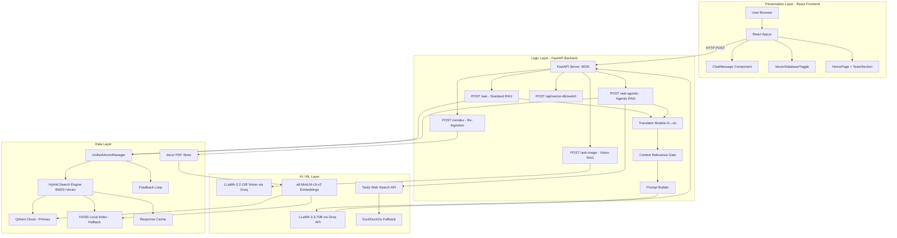

---

### Figure 3.2: Standard (Non-Agentic) RAG Pipeline Flow

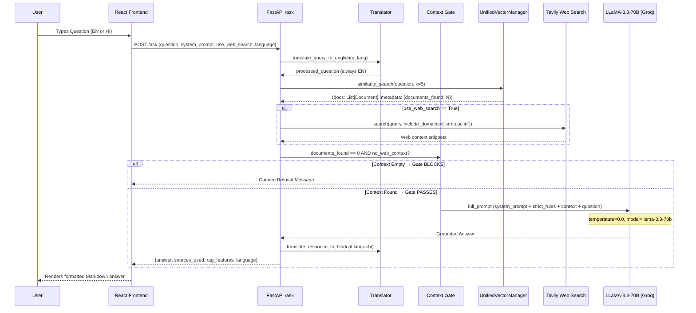

---

### Figure 3.3: Agentic RAG Pipeline with Tool Dispatch

```mermaid
sequenceDiagram
    participant User
    participant React as React Frontend (Agentic Toggle ON)
    participant API as FastAPI /ask-agentic
    participant IC as Intent Classifier
    participant TR as Tool Registry
    participant RAG as Standard RAG Pipeline
    participant LLM as LLaMA-3.3-70B (Groq)

    User->>React: Toggle Agentic ON; Ask Question
    React->>API: POST /ask-agentic {question, system_prompt, language}
    API->>IC: classify_intent(question, llm)
    
    Note over IC: LLM classifies intent:<br/>web_search | rag_only | schedule_query | etc.

    alt Intent == tool (e.g. web_search)
        IC-->>API: {intent: "web_search", args: {query: "..."}}
        API->>TR: execute_tool("web_search", args)
        TR-->>API: tool_result: {message: "...", data: {...}}
    else Intent == "rag_only"
        IC-->>API: {intent: "rag_only", args: {}}
    end

    API->>RAG: combine_sources(question, use_web_search=False)
    RAG-->>API: (context, {documents_found: N})

    alt intent=="rag_only" AND docs_found==0
        API-->>React: Canned Refusal
    else Context or Tool Result Available
        API->>LLM: full_prompt (context + tool_result + strict rules)
        LLM-->>API: Grounded Answer
        API-->>React: {answer, agent_action, intent, sources_used}
    end

    React-->>User: Answer + Agent Action Card displayed
```

---

### Figure 3.4: UnifiedVectorManager Component Architecture

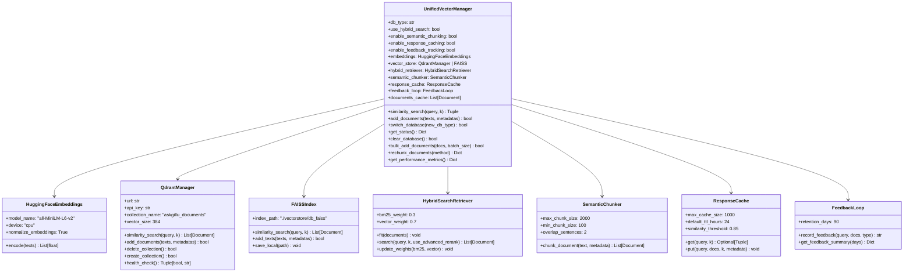

---

### Figure 3.5: Hybrid Search Engine Architecture (BM25 + Vector)

```mermaid
graph TD
    Q[User Query] --> VE[Vector Embedding\n all-MiniLM-L6-v2]
    Q --> BM[BM25 Tokenizer\n Term Frequency]

    VE --> VS{Vector Store\nQdrant or FAISS}
    VS --> VR[Vector Results\n Top-K by cosine similarity]

    BM --> BR[BM25 Results\n Top-K by TF-IDF score]

    VR --> RRF[Reciprocal Rank Fusion\n RRF Score = Σ 1/(k + rank_i)]
    BR --> RRF

    RRF --> AR[Advanced Re-Ranker]
    AR --> |strategy: rrf / semantic / diversity| FR[Final Top-5 Documents]

    FR --> CTX[Context Assembly\n UNIVERSITY DOCUMENTS: ...]
```

---

### Figure 3.6: Context Relevance Gating Mechanism

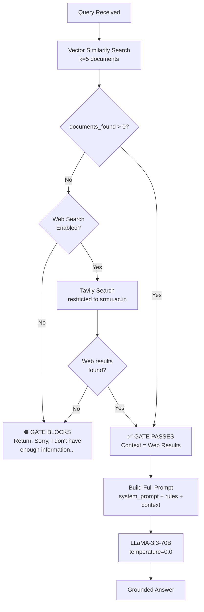

---

### Figure 3.7: Document Ingestion and Chunking Pipeline

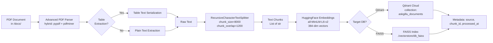

---

### Figure 3.8: Level-0 Data Flow Diagram

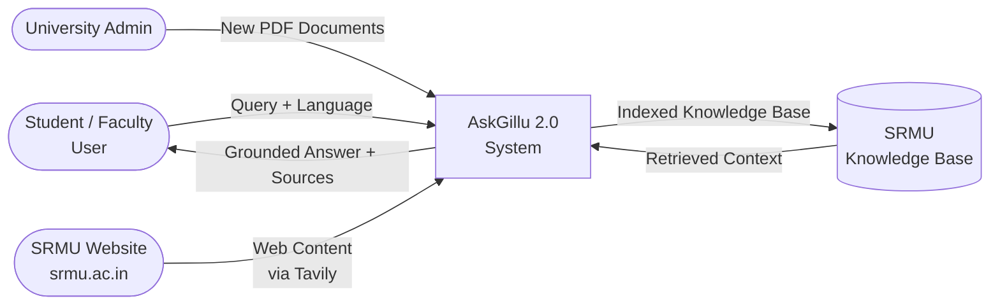

---

### Figure 3.9: Level-1 Data Flow Diagram (RAG Pipeline)

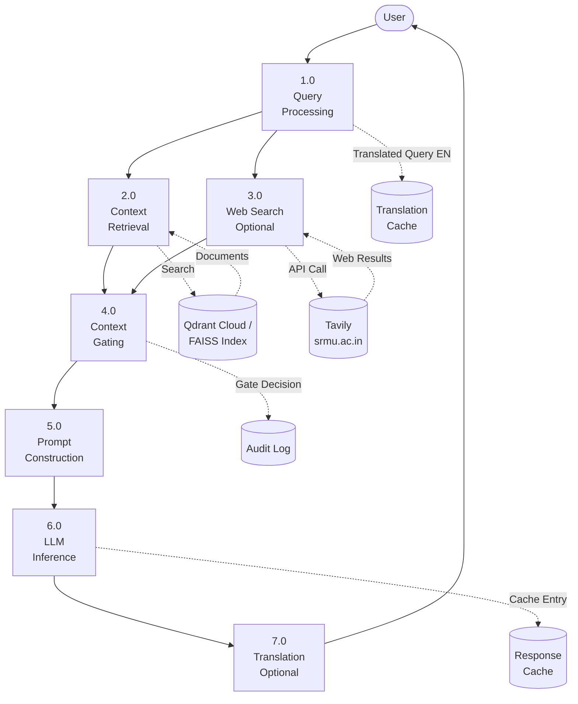

---

### Figure 3.10: REST API Endpoint Map

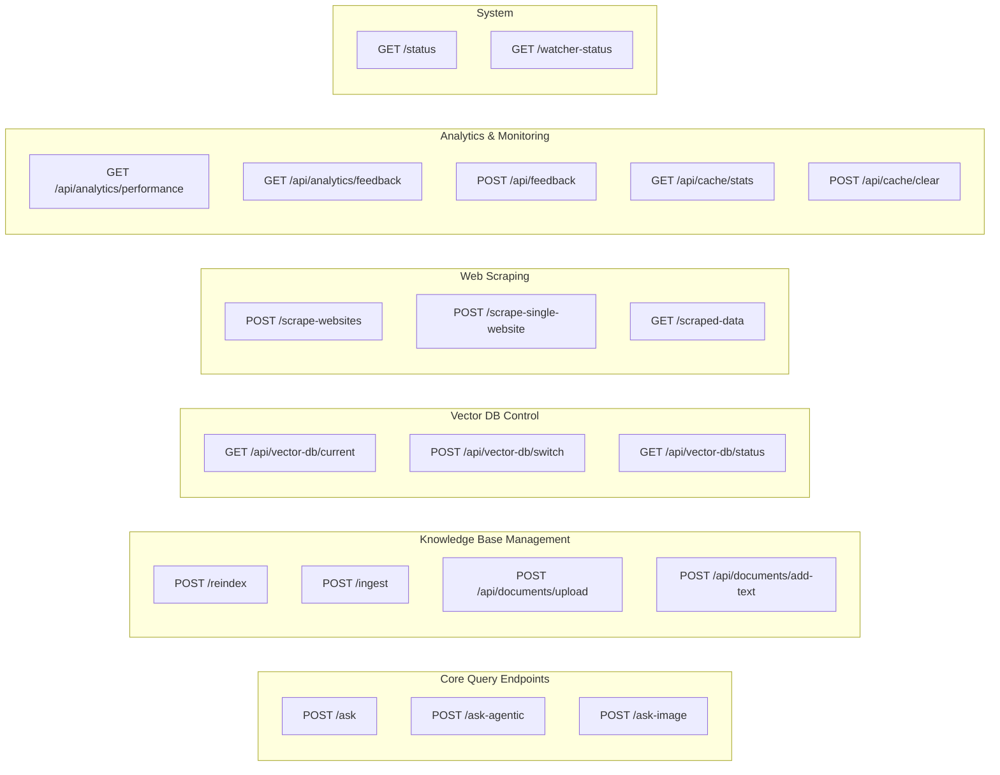

---

### Figure 3.11: Qdrant Collection and FAISS Index Schema

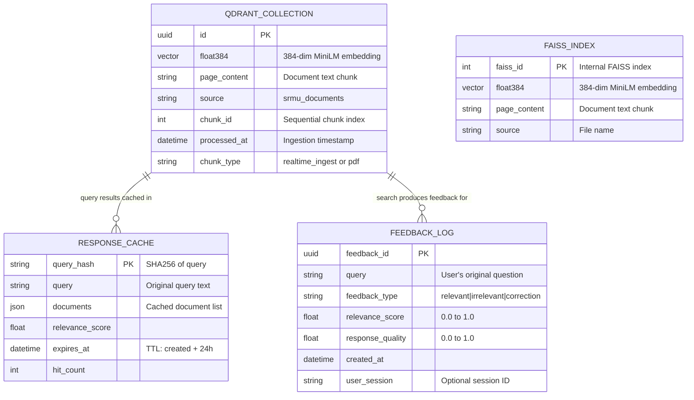

---

### Figure 3.12: React Component Tree

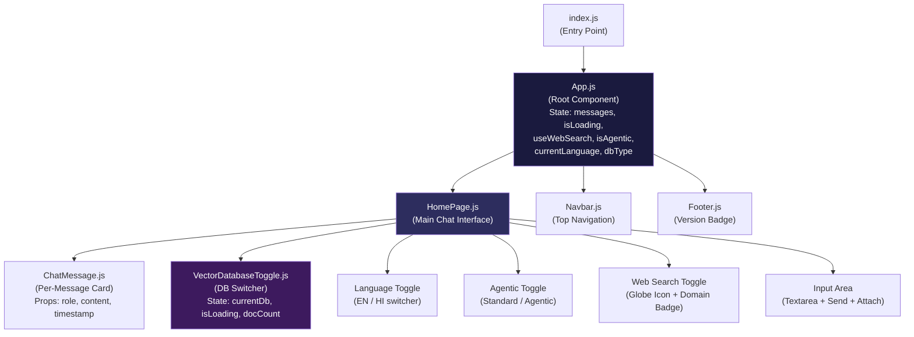

---

### Figure 3.13: Anti-Hallucination Layer Architecture

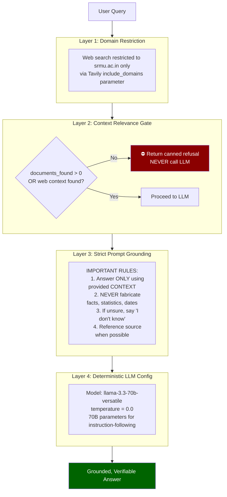
