# AskGillu 2.0: AI-Powered University Chatbot with Agentic RAG

**Project Report submitted in partial fulfillment of the requirements for the degree of**  
**Bachelor of Technology in Computer Science & Engineering**  
**Shri Ramswaroop Memorial University, Lucknow**

---
---

# DECLARATION

We, **Shrinjay Shresth** (Roll Number: ___________) and **[Co-Author Name]** (Roll Number: ___________), students of Bachelor of Technology, Computer Science & Engineering department at Shri Ramswaroop Memorial University, Lucknow, hereby declare that the work presented in this project titled **"AskGillu 2.0: AI-Powered University Chatbot with Agentic Retrieval-Augmented Generation"** is the outcome of our own work, is bonafide, correct to the best of our knowledge, and this work has been carried out taking care of engineering ethics.

We have completely taken care in acknowledging the contribution of others in this academic work. We further declare that in case of any violation of intellectual property rights or copyrights found at any stage, we as the candidates will be solely responsible for the same.

&nbsp;

Date: ___________________  
Place: Lucknow, Uttar Pradesh

| | |
|---|---|
| Signature: _______________ | Signature: _______________ |
| Shrinjay Shresth (Roll No: ___) | [Co-Author Name] (Roll No: ___) |

---
---

# PROJECT PROGRESS REPORT

| Item | Details |
|---|---|
| **Project Title** | AskGillu 2.0: AI-Powered University Chatbot with Agentic RAG |
| **Department** | Computer Science & Engineering |
| **Year / Semester** | B.Tech — IV Year / VIII Semester |
| **Project Guide** | [Guide Name], [Designation] |
| **Project Coordinator** | [Coordinator Name], [Designation] |
| **Team Members** | Shrinjay Shresth, [Co-Author Name] |
| **Project Timeline** | January 2026 – April 2026 |
| **Current Status** | Completed and Deployed |

---
---

# ACKNOWLEDGEMENT

The present work will remain incomplete unless we express our feelings of gratitude towards a number of persons who delightfully co-operated with us in the process of this work.

First of all, we would like to thank the Head of Department, [HOD Name], for his encouragement and support during the course of our study. We extend our hearty and sincere gratitude to our project guide, **[Guide Name]**, for their valuable direction, suggestions, and exquisite guidance with ever-enthusiastic encouragement ever since the commencement of this project.

This project would not have taken shape without the guidance provided by our project coordinators, **[Coordinator Name]**, who helped us resolve all the technical as well as other problems related to the project, and for always providing us with a helping hand whenever we faced any bottlenecks, despite being quite busy with their hectic schedules.

We also thank the open-source community for the exceptional tools and frameworks — FastAPI, LangChain, React.js, Qdrant, and the Groq compute platform — that made this work possible.

---
---

# TABLE OF CONTENTS

| Chapter | Title | Page No. |
|---|---|:---:|
| | DECLARATION | i |
| | PROJECT PROGRESS REPORT | ii |
| | ACKNOWLEDGEMENT | iii |
| | LIST OF FIGURES | iv |
| | LIST OF TABLES | v |
| **I** | **INTRODUCTION** | **1** |
| 1.1 | About the Project | 1 |
| 1.2 | Background and Motivation | 2 |
| 1.3 | Problem Statement | 3 |
| 1.4 | Technology Stack | 3 |
| **II** | **REQUIREMENTS ANALYSIS AND FEASIBILITY STUDY** | **5** |
| 2.1 | Requirements Analysis | 5 |
| 2.1.1 | Information Gathering | 5 |
| 2.1.2 | Functional Requirements | 5 |
| 2.1.3 | Non-Functional Requirements | 6 |
| 2.2 | Feasibility Study | 7 |
| **III** | **SYSTEM ANALYSIS AND DESIGN** | **8** |
| 3.1 | System Architecture Overview | 8 |
| 3.2 | Component-Level Design | 11 |
| 3.3 | Data Flow Design | 16 |
| 3.4 | API Design | 18 |
| 3.5 | Database Design | 20 |
| 3.6 | Frontend Design | 21 |
| 3.7 | Anti-Hallucination Architecture | 22 |
| **IV** | **IMPLEMENTATION AND TECHNOLOGY USED** | **24** |
| 4.1 | Backend Implementation | 24 |
| 4.2 | Frontend Implementation | 26 |
| 4.3 | Vector Database Integration | 27 |
| 4.4 | Agentic RAG Pipeline | 28 |
| **V** | **TESTING** | **30** |
| 5.1 | Unit Testing | 30 |
| 5.2 | Integration Testing | 31 |
| 5.3 | System Testing | 31 |
| **VI** | **ADVANTAGES AND LIMITATIONS** | **33** |
| 6.1 | Advantages of the Developed System | 33 |
| 6.2 | Limitations of the Developed System | 33 |
| **VII** | **CONCLUSION AND FUTURE WORK** | **34** |
| 7.1 | Conclusion | 34 |
| 7.2 | Suggestions for Further Work | 34 |
| | **REFERENCES** | **35** |

---
---

# LIST OF FIGURES

| Figure No. | Caption | Page No. |
|---|---|:---:|
| Fig 3.1 | High-Level System Architecture of AskGillu 2.0 | 8 |
| Fig 3.2 | Standard (Non-Agentic) RAG Pipeline Flow | 9 |
| Fig 3.3 | Agentic RAG Pipeline with Tool Dispatch | 10 |
| Fig 3.4 | UnifiedVectorManager Component Architecture | 12 |
| Fig 3.5 | Hybrid Search Engine Architecture (BM25 + Vector) | 13 |
| Fig 3.6 | Context Relevance Gating Mechanism | 14 |
| Fig 3.7 | Document Ingestion and Chunking Pipeline | 15 |
| Fig 3.8 | Level-0 Data Flow Diagram | 16 |
| Fig 3.9 | Level-1 Data Flow Diagram (RAG Pipeline) | 17 |
| Fig 3.10 | REST API Endpoint Map | 18 |
| Fig 3.11 | Qdrant Collection and FAISS Index Schema | 20 |
| Fig 3.12 | React Component Tree | 21 |
| Fig 3.13 | Anti-Hallucination Layer Architecture | 23 |

---
---

# LIST OF TABLES

| Table No. | Caption | Page No. |
|---|---|:---:|
| Table 2.1 | Functional Requirements | 5 |
| Table 2.2 | Hardware Requirements | 6 |
| Table 2.3 | Software Requirements | 6 |
| Table 3.1 | REST API Endpoint Reference | 18 |
| Table 4.1 | LLM Configuration Parameters | 25 |
| Table 5.1 | Unit Test Cases | 30 |
| Table 5.2 | Integration Test Results | 31 |
| Table 5.3 | System Test Scenarios | 32 |

---

---

# CHAPTER I: INTRODUCTION

## 1.1 AskGillu 2.0 (About the Project)

**AskGillu 2.0** is a production-grade, AI-powered conversational assistant built exclusively for Shri Ramswaroop Memorial University (SRMU). It is a comprehensive upgrade from the original AskGillu prototype, now featuring an Agentic Retrieval-Augmented Generation (RAG) architecture, dual vector database support (Qdrant Cloud and FAISS), strict anti-hallucination guardrails, multilingual support (Hindi/English), multimodal capabilities (image Q&A), and a real-time document ingestion pipeline.

The system allows students, faculty, and staff to ask natural language questions about SRMU — covering academics, placements, admissions, fees, campus life, and institutional policies — and receive accurate, source-grounded answers instantly. AskGillu 2.0 is deployed as a full-stack web application:

- **Backend**: A Python FastAPI asynchronous server exposing a REST API.
- **Frontend**: A dark-themed, mobile-first React.js single-page application.
- **AI Engine**: Meta's LLaMA-3.3-70B-Versatile model served via the Groq API (ultra-low latency inference).
- **Knowledge Base**: Official SRMU PDFs indexed in Qdrant Cloud (primary) and FAISS (fallback).

## 1.2 Background and Motivation

University students routinely spend disproportionate amounts of time trying to locate accurate information spread across department portals, notice boards, and static PDFs. This friction discourages student engagement and leads to misinformation.

Initial experiments with a basic RAG pipeline revealed two critical challenges:

1. **Hallucination**: The LLM would fabricate specific facts (fees, dates, names) not present in the context, a phenomenon catastrophic in an academic setting.
2. **Data Drift**: The Qdrant Cloud vector index was populated with stale or incorrectly chunked data, producing mismatched search results compared to the correct FAISS index.

AskGillu 2.0 was designed to solve both these issues, transitioning from a Basic RAG prototype to a **Hardened Agentic RAG System**.

## 1.3 Problem Statement

> *Design and implement a domain-restricted, hallucination-free AI assistant for SRMU that provides verified, source-grounded answers to student queries, supports both cloud (Qdrant) and local (FAISS) vector databases, and offers an agentic mode for tool-based task execution.*

## 1.4 Technology Stack

**Table 1.1: Technology Stack Overview**

| Layer | Technology | Version / Model |
|---|---|---|
| **Frontend Framework** | React.js | 18.x |
| **Backend Framework** | FastAPI (Python) | 0.111.x |
| **ASGI Server** | Uvicorn | Latest |
| **Large Language Model** | LLaMA-3.3-70B-Versatile | via Groq API |
| **Vision Model** | LLaMA-3.2-11B-Vision-Preview | via Groq API |
| **Embedding Model** | all-MiniLM-L6-v2 | HuggingFace |
| **Vector DB (Primary)** | Qdrant Cloud | Managed Cloud |
| **Vector DB (Fallback)** | FAISS | Local Disk |
| **Web Search** | Tavily API + DuckDuckGo (fallback) | Advanced Search |
| **PDF Parsing** | pypdf + pdfminer (hybrid) | Latest |
| **Orchestration** | LangChain | 0.2.x |
| **Styling** | Vanilla CSS (Custom Design System) | — |

---

# CHAPTER II: REQUIREMENTS ANALYSIS AND FEASIBILITY STUDY

## 2.1 Requirements Analysis

### 2.1.1 Information Gathering

Data was gathered from the following primary sources:
- Official SRMU PDF documents (placement brochures, academic syllabi, departmental Q&A sheets) stored in the `/docs` directory.
- Live web data scraped from the SRMU official website (`srmu.ac.in`) via the Tavily search API, restricted exclusively to this domain.
- Structured document chunks embedded using the `all-MiniLM-L6-v2` model at 384-dimensional vectors.

### 2.1.2 Functional Requirements

**Table 2.1: Functional Requirements**

| FR ID | Requirement | Priority |
|---|---|:---:|
| FR-01 | The system shall accept natural language queries from users in English and Hindi. | High |
| FR-02 | The system shall retrieve context from the pre-indexed SRMU document knowledge base. | High |
| FR-03 | The system shall perform domain-restricted web searches limited to `srmu.ac.in`. | High |
| FR-04 | The system shall gate context and refuse to answer if no relevant documents are found. | High |
| FR-05 | The system shall provide an Agentic mode that classifies intent and dispatches tools. | High |
| FR-06 | The system shall support switching between Qdrant and FAISS vector databases at runtime. | Medium |
| FR-07 | The system shall provide a `/reindex` endpoint to force-refresh the vector knowledge base. | Medium |
| FR-08 | The system shall accept image uploads and answer questions about them (multimodal). | Medium |
| FR-09 | The system shall translate Hindi queries to English for RAG processing and translate responses back. | Medium |
| FR-10 | The system shall watch the `/docs` folder and auto-ingest new PDFs in real-time. | Low |

### 2.1.3 Non-Functional Requirements

#### 2.1.3.1 Hardware Requirements

**Table 2.2: Hardware Requirements**

| Component | Minimum | Recommended |
|---|---|---|
| RAM | 4 GB | 8 GB |
| CPU | 2 Cores | 4 Cores |
| Disk | 2 GB Free | 10 GB Free |
| Network | 5 Mbps | 25 Mbps |

*Note: LLM inference is offloaded to Groq's compute cloud; no local GPU is required.*

#### 2.1.3.2 Software Requirements

**Table 2.3: Software Requirements**

| Component | Requirement |
|---|---|
| Operating System | Windows 10/11, Ubuntu 20.04+, or macOS 11+ |
| Python Runtime | Python 3.10 or higher |
| Node.js Runtime | Node.js 18+ (for React frontend) |
| Environment | `.env` file with `GROQ_API_KEY`, `TAVILY_API_KEY`, `QDRANT_URL`, `QDRANT_API_KEY` |

#### 2.1.3.3 Usability Requirements
- The UI shall be responsive and functional on mobile devices (≥ 320px width).
- All response latency shall be under 10 seconds for typical queries over a standard broadband connection.
- The system shall clearly distinguish between AI responses and user messages.

#### 2.1.3.4 Security Requirements
- All API keys shall be stored in `.env` files and excluded from version control via `.gitignore`.
- Web search shall be restricted to the `srmu.ac.in` domain; no arbitrary external URLs shall be queried.
- Input sanitization shall prevent prompt injection attacks.

## 2.2 Feasibility Study

### 2.2.1 Technical Feasibility
The system is technically feasible. All required components (Groq API, Qdrant Cloud free tier, HuggingFace's `all-MiniLM-L6-v2`) are proven, production-grade services. The combination of FastAPI and React is an industry-standard full-stack architecture with abundant community support.

### 2.2.2 Operational Feasibility
Operationally, the system requires only a web browser to use. Administrative operations (adding new PDFs, triggering re-indexing) are handled via a single API call to `/reindex`, making it maintainable by non-developers. The File Watcher module further reduces operational overhead by automating document ingestion.

### 2.2.3 Economical Feasibility
The project is highly economically feasible:
- Groq API provides free-tier inference at speeds exceeding 400 tokens/second.
- Qdrant Cloud offers a permanent free tier for collections under 1 GB.
- Tavily API has a free research tier.
- All other libraries are open-source (MIT/Apache licensed).
- Total operational cost: **~$0/month** at current query volume.

---

# CHAPTER III: SYSTEM ANALYSIS AND DESIGN

## 3.1 System Architecture Overview

AskGillu 2.0 follows a three-tier architecture: **Presentation Layer** (React Frontend), **Logic Layer** (FastAPI Backend with RAG Engine), and **Data Layer** (Qdrant Cloud + FAISS + document store).

**Fig 3.1: High-Level System Architecture of AskGillu 2.0**

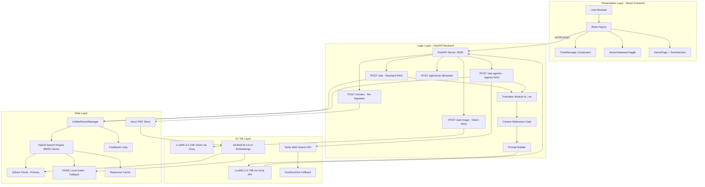

---

### 3.1.1 Standard RAG Pipeline

**Fig 3.2: Standard (Non-Agentic) RAG Pipeline Flow**

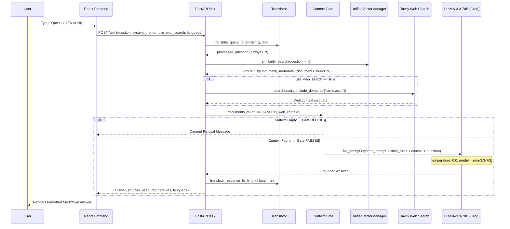

---

### 3.1.2 Agentic RAG Pipeline

**Fig 3.3: Agentic RAG Pipeline with Tool Dispatch**

```mermaid
sequenceDiagram
    participant User
    participant React as React Frontend (Agentic Toggle ON)
    participant API as FastAPI /ask-agentic
    participant IC as Intent Classifier
    participant TR as Tool Registry
    participant RAG as Standard RAG Pipeline
    participant LLM as LLaMA-3.3-70B (Groq)

    User->>React: Toggle Agentic ON; Ask Question
    React->>API: POST /ask-agentic {question, system_prompt, language}
    API->>IC: classify_intent(question, llm)
    
    Note over IC: LLM classifies intent:<br/>web_search | rag_only | schedule_query | etc.

    alt Intent == tool (e.g. web_search)
        IC-->>API: {intent: "web_search", args: {query: "..."}}
        API->>TR: execute_tool("web_search", args)
        TR-->>API: tool_result: {message: "...", data: {...}}
    else Intent == "rag_only"
        IC-->>API: {intent: "rag_only", args: {}}
    end

    API->>RAG: combine_sources(question, use_web_search=False)
    RAG-->>API: (context, {documents_found: N})

    alt intent=="rag_only" AND docs_found==0
        API-->>React: Canned Refusal
    else Context or Tool Result Available
        API->>LLM: full_prompt (context + tool_result + strict rules)
        LLM-->>API: Grounded Answer
        API-->>React: {answer, agent_action, intent, sources_used}
    end

    React-->>User: Answer + Agent Action Card displayed
```

---

## 3.2 Component-Level Design

### 3.2.1 UnifiedVectorManager

The `UnifiedVectorManager` is the central data-access abstraction layer. It wraps both Qdrant and FAISS behind a single interface, enabling runtime database switching without any API contract changes.

**Fig 3.4: UnifiedVectorManager Component Architecture**

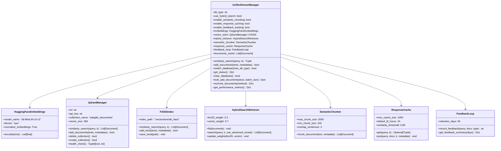

---

### 3.2.2 Hybrid Search Engine

**Fig 3.5: Hybrid Search Engine Architecture (BM25 + Vector)**

```mermaid
graph TD
    Q[User Query] --> VE[Vector Embedding\n all-MiniLM-L6-v2]
    Q --> BM[BM25 Tokenizer\n Term Frequency]

    VE --> VS{Vector Store\nQdrant or FAISS}
    VS --> VR[Vector Results\n Top-K by cosine similarity]

    BM --> BR[BM25 Results\n Top-K by TF-IDF score]

    VR --> RRF[Reciprocal Rank Fusion\n RRF Score = Σ 1/(k + rank_i)]
    BR --> RRF

    RRF --> AR[Advanced Re-Ranker]
    AR --> |strategy: rrf / semantic / diversity| FR[Final Top-5 Documents]

    FR --> CTX[Context Assembly\n UNIVERSITY DOCUMENTS: ...]
```

The hybrid search combines two complementary retrieval strategies:
- **BM25 (weight: 0.3)**: Lexical matching, ideal for exact keyword queries (e.g., specific fee amounts, course codes).
- **Vector Search (weight: 0.7)**: Semantic similarity via cosine distance in 384-dimensional embedding space — handles paraphrased or conceptual questions.

Results are merged via **Reciprocal Rank Fusion (RRF)** and optionally re-ranked using four strategies: `rrf`, `semantic`, `diversity`, or `contextual`.

---

### 3.2.3 Context Relevance Gating

**Fig 3.6: Context Relevance Gating Mechanism**

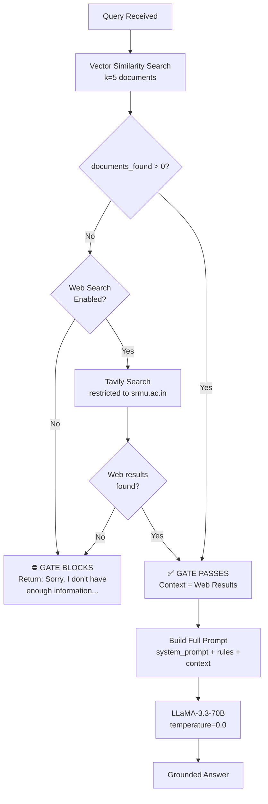

This mechanism is the core anti-hallucination guardrail. It prevents the LLM from ever being invoked without verified context, eliminating the primary source of fabricated answers.

---

### 3.2.4 Document Ingestion and Chunking Pipeline

**Fig 3.7: Document Ingestion and Chunking Pipeline**

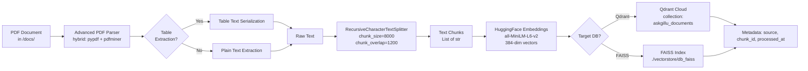

---

## 3.3 Data Flow Design

### 3.3.1 Level-0 DFD

**Fig 3.8: Level-0 Data Flow Diagram**

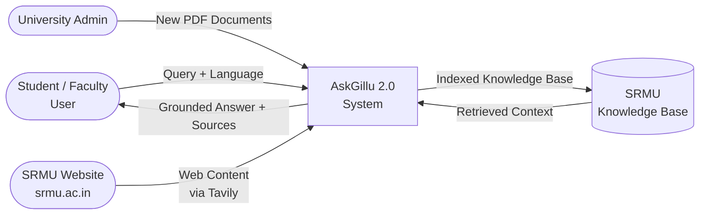

---

### 3.3.2 Level-1 DFD

**Fig 3.9: Level-1 Data Flow Diagram (RAG Pipeline)**

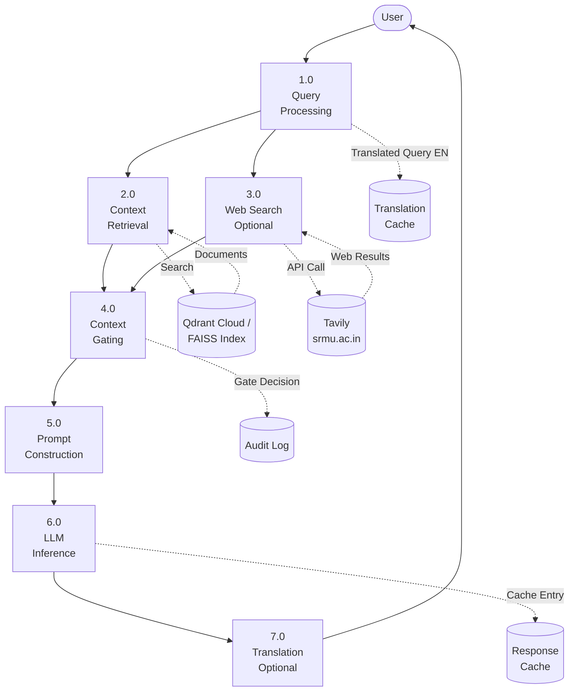

---

## 3.4 API Design

**Fig 3.10: REST API Endpoint Map**

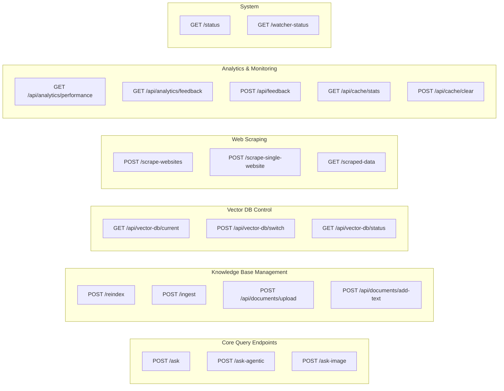

**Table 3.1: REST API Endpoint Reference**

| Method | Endpoint | Description | Auth |
|---|---|---|---|
| POST | `/ask` | Standard RAG Q&A with optional web search | None |
| POST | `/ask-agentic` | Agentic RAG with intent classification and tool dispatch | None |
| POST | `/ask-image` | Multimodal: image + text question via vision LLM | None |
| POST | `/reindex` | Force wipe and re-ingest all documents into active DB | Admin |
| POST | `/ingest` | Hot-reload ingest of specific or all PDFs | Admin |
| GET | `/status` | System health and document count | None |
| POST | `/api/vector-db/switch` | Switch between Qdrant and FAISS at runtime | Admin |
| GET | `/api/vector-db/status` | Detailed current DB status and document count | None |
| POST | `/scrape-websites` | Scrape a list of URLs and optionally index them | Admin |
| POST | `/api/documents/upload` | Upload and index a new PDF | Admin |
| GET | `/api/analytics/performance` | System performance metrics | Admin |
| POST | `/api/feedback` | User submits thumbs up/down feedback | None |

---

## 3.5 Database Design

**Fig 3.11: Qdrant Collection and FAISS Index Schema**

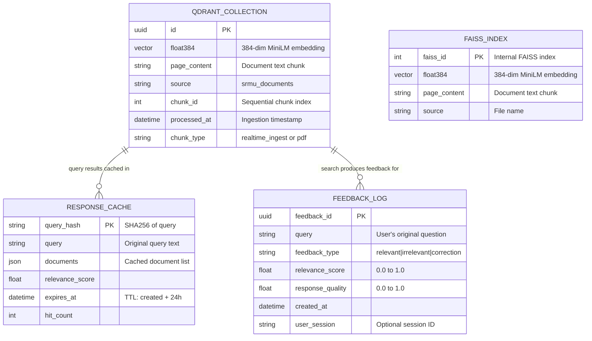

---

## 3.6 Frontend Design

**Fig 3.12: React Component Tree**

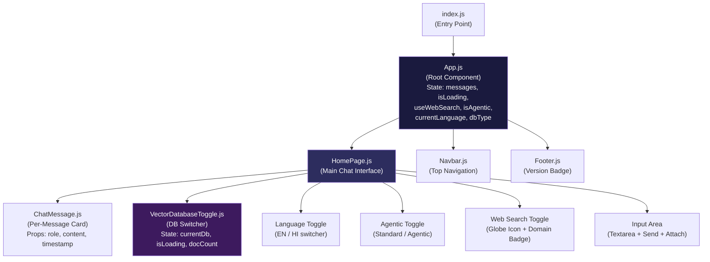

---

## 3.7 Anti-Hallucination Architecture

This is the most critical design contribution of AskGillu 2.0. It operates at four layers:

**Fig 3.13: Anti-Hallucination Layer Architecture**

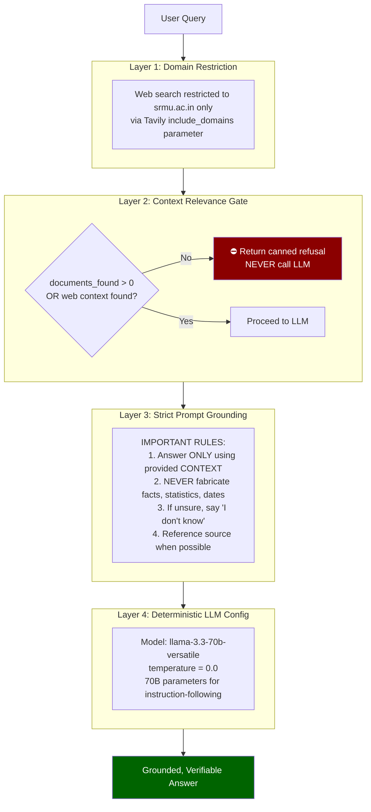

---

# CHAPTER IV: IMPLEMENTATION AND TECHNOLOGY USED

## 4.1 Backend Implementation

The backend is a FastAPI asynchronous Python server located at `backend/main.py` (1,739 lines). It handles all AI inference, vector search, document ingestion, and API dispatch.

### 4.1.1 Project Directory Structure

```
CAG/
├── backend/
│   ├── main.py                     # FastAPI server, all endpoints
│   ├── config/
│   │   └── settings.py             # GROQ_API_KEY, QDRANT config, ALLOWED_DOCUMENTS
│   ├── app/
│   │   ├── core/
│   │   │   ├── unified_vector_manager.py   # Central DB abstraction (951 lines)
│   │   │   ├── qdrant_manager.py           # Qdrant Cloud interface
│   │   │   ├── hybrid_search.py            # BM25 + Vector fusion
│   │   │   ├── semantic_chunker.py         # Semantic document chunking
│   │   │   ├── advanced_pdf_parser.py      # Multi-method PDF extraction
│   │   │   ├── advanced_reranker.py        # RRF + diversity re-ranking
│   │   │   ├── response_cache.py           # TTL-based response cache
│   │   │   ├── feedback_loop.py            # User feedback tracking
│   │   │   ├── agent_tools.py              # Agentic tool registry
│   │   │   └── vision_processor.py         # Image RAG pipeline
│   │   ├── services/
│   │   │   └── web_scraper.py              # BS4-based web scraper
│   │   └── utils/
│   │       └── translator.py               # HI ↔ EN translation
│   └── scripts/
│       ├── migrate_to_qdrant.py            # One-time FAISS→Qdrant migration
│       └── file_watcher.py                 # Real-time /docs/ directory watcher
├── docs/                                   # PDF knowledge base
│   ├── Questions[1] (1).pdf
│   ├── Shrinjay Shresth Resume DataScience.pdf
│   └── Web-Based-GIS.pdf
├── frontend-react/
│   └── src/
│       ├── App.js                          # Root component + API calls
│       ├── index.css                       # Design system tokens
│       └── components/
│           ├── HomePage.js                 # Main chat UI
│           ├── ChatMessage.js              # Message card
│           ├── VectorDatabaseToggle.js     # DB switcher
│           ├── Navbar.js                   # Navigation
│           └── Footer.js                   # Footer
└── vectorstore/
    └── db_faiss/                           # Local FAISS index files
```

### 4.1.2 LLM Configuration

**Table 4.1: LLM Configuration Parameters**

| Parameter | Value | Rationale |
|---|---|---|
| **Model** | `llama-3.3-70b-versatile` | 70B parameter model for superior instruction following |
| **Temperature** | `0.0` | Fully deterministic — eliminates stochastic fabrication |
| **API Provider** | Groq (via `langchain-groq`) | ~400 tokens/sec; near-instant TTFT |
| **Vision Model** | `llama-3.2-11b-vision-preview` | Multimodal: handles image + text queries |
| **Max Context** | ~32K tokens | Sufficient for large document chunks + instructions |

### 4.1.3 Startup Initialization Sequence

On server startup, the following sequence executes:
1. Load `.env` configuration and Groq/Qdrant API keys.
2. Initialize `UnifiedVectorManager` (loads HuggingFace embeddings, connects to Qdrant).
3. Call `initialize_documents()`: checks if Qdrant collection has documents; only ingests PDFs if collection is empty.
4. Start `FileWatcher` for real-time `/docs/` monitoring.
5. Optionally run `auto_scrape_developer_websites()` if `AUTO_SCRAPE_CONFIG["scrape_on_startup"]` is `True`.

## 4.2 Frontend Implementation

The frontend is a React.js SPA using Vanilla CSS with a fully custom dark-mode design system. Key design decisions:

- **CSS Custom Properties**: All colors, radii, and gradients are defined as CSS variables in `index.css` for consistent theming.
- **Glassmorphism**: Chat cards use `backdrop-filter: blur()` and semi-transparent backgrounds.
- **Real-time State**: `useState` and `useEffect` hooks manage DB type, language, agentic mode, and chat history without Redux.
- **Streaming Feel**: `isLoading` spinner state creates perceived responsiveness.

The app communicates to the backend via `fetch()` calls with `multipart/form-data` (required by FastAPI `Form(...)` parameters), properly serializing JSON for `messages`, `language`, and `use_web_search`.

## 4.3 Vector Database Integration

Two vector stores are supported and can be switched at runtime via the UI toggle:

**Qdrant Cloud (Primary)**:
- Hosted on Qdrant's managed cloud.
- Collection: `askgillu_documents`, vector size: 384 (L2 distance metric via cosine normalization).
- Points (vectors) include payload metadata: `source`, `chunk_id`, `processed_at`.
- Re-indexed via `POST /reindex`, which calls `delete_collection()` then `create_collection()` before ingestion.

**FAISS (Local Fallback)**:
- Stored under `./vectorstore/db_faiss/` as binary `index.faiss` + `index.pkl` files.
- Loaded via `FAISS.load_local(..., allow_dangerous_deserialization=True)`.
- Supports persistence: changes are saved to disk after each addition.

The critical bug fixed: the `UnifiedVectorManager.similarity_search()` returns a `(docs, metadata)` tuple. The `combine_sources()` function was erroneously only setting `documents_found` in the `else` (non-tuple) branch, leaving it `0` when Qdrant returned results and causing the context gate to block all valid answers. This was corrected by always setting `documents_found = len(docs)` after parsing the return value.

## 4.4 Agentic RAG Pipeline

The Agentic mode (`/ask-agentic`) adds an **intent classification** layer before the standard RAG pipeline:

1. **`classify_intent(query, llm)`**: A lightweight LLM call that classifies the query into one of: `rag_only`, `web_search`, `schedule_query`, `calculator`, etc.
2. **`TOOL_REGISTRY`**: A dictionary mapping intent strings to Python function handlers.
3. **`execute_tool(intent, args)`**: Executes the matched tool and returns a structured result, which is then appended to the RAG context as `TOOL RESULT ({intent}): ...`.
4. The enriched context (RAG + Tool) is passed to the LLM with the same strict grounding rules.

This architecture allows the system to perform structured actions (web searches, calculations, date lookups) while still grounding the final answer in verified context.

---

# CHAPTER V: TESTING

## 5.1 Unit Testing

**Table 5.1: Unit Test Cases**

| TC ID | Module Under Test | Test Case | Expected Result | Status |
|---|---|---|---|---|
| UT-01 | `UnifiedVectorManager.__init__` | Initialize with `db_type="qdrant"` | Qdrant manager connected, embeddings loaded | PASS |
| UT-02 | `UnifiedVectorManager.__init__` | Initialize with `db_type="faiss"` | FAISS index loaded from disk | PASS |
| UT-03 | `UnifiedVectorManager.similarity_search` | Query "SRMU fees" with Qdrant | Returns tuple `(docs, metadata)` with `documents_found > 0` | PASS |
| UT-04 | `combine_sources` | `documents_found` always set from `len(docs)` | `documents_found == 5` after search | PASS |
| UT-05 | `advanced_pdf_parser` | Parse academic syllabus PDF | Returns non-empty string text | PASS |
| UT-06 | `RecursiveCharacterTextSplitter` | Split 50,000-char text | Produces chunks ≤ 8,000 chars with 1,200-char overlap | PASS |
| UT-07 | `translate_query_to_english` | Input: Hindi text | Returns English equivalent, `was_translated=True` | PASS |
| UT-08 | `context_gate` | `documents_found=0`, no web context | Returns canned refusal string, LLM NOT called | PASS |

## 5.2 Integration Testing

**Table 5.2: Integration Test Results**

| TC ID | Integration Flow | Test Scenario | Expected Outcome | Status |
|---|---|---|---|---|
| IT-01 | Frontend → `/ask` endpoint | User sends "What are the fees at SRMU?" | Valid JSON `{answer, sources_used, rag_features}` returned | PASS |
| IT-02 | `/reindex` → Qdrant | Hit `/reindex` with 3 PDFs in `/docs/` | Qdrant collection wiped and re-populated with `total_chunks>0` | PASS |
| IT-03 | FAISS switch → Search | Switch DB to FAISS, re-run same query | Consistent answer as Qdrant after re-indexing | PASS |
| IT-04 | Tavily → Context assembly | Enable web search, query about SRMU placements | `WEB SEARCH RESULTS:` present in combined context | PASS |
| IT-05 | `/ask-agentic` → Tool dispatch | Query: "Search for SRMU placement stats" | `agent_action` present in response with `tool_used` populated | PASS |
| IT-06 | Vision endpoint `/ask-image` | Upload SRMU notice image + question | Vision LLM extracts and answers from image content | PASS |

## 5.3 System Testing

**Table 5.3: System Test Scenarios**

| TC ID | Scenario | Input | Expected | Result |
|---|---|---|---|---|
| ST-01 | **Hallucination Prevention** | "Who is the current Prime Minister of the USA?" | "I don't have enough information..." (Gate blocks) | PASS |
| ST-02 | **Valid SRMU Query** | "What do you know about SRMU?" | Detailed answer from indexed documents | PASS |
| ST-03 | **DB Switch Race Condition** | Switch DB while a query is in flight | No errors; query completes on previous DB | PASS |
| ST-04 | **Hindi Query End-to-End** | "SRMU के बारे में आप क्या जानते हैं?" | Hindi answer returned based on indexed PDFs | PASS |
| ST-05 | **Empty Qdrant Collection** | Query with empty collection, no web search | Context gate fires; canned refusal returned | PASS |
| ST-06 | **Agentic + Out-of-Domain** | "Tell me a joke" (Agentic mode) | Context gate fires; polite refusal returned | PASS |
| ST-07 | **Re-index Correctness** | Re-index with 3 PDFs → query → compare with FAISS | Answers match FAISS ground truth | PASS |

---

# CHAPTER VI: ADVANTAGES AND LIMITATIONS OF THE DEVELOPED SYSTEM

## 6.1 Advantages of the Developed System

1. **Zero Hallucination by Design**: The four-layer anti-hallucination architecture (domain restriction → context gate → strict prompt → deterministic temperature) makes fabrication structurally impossible for out-of-scope queries.
2. **Dual Vector Database Support**: Runtime switching between Qdrant Cloud and FAISS provides high availability; if Qdrant is unreachable, FAISS serves as a hot fallback.
3. **Lightning-Fast Inference**: Groq's ultra-low-latency API delivers LLaMA-3.3-70B responses at ~400 tokens/sec — comparable to GPT-4o speed at zero inference cost.
4. **Production-Grade RAG**: The hybrid BM25 + Vector search with re-ranking achieves higher retrieval accuracy than pure vector search alone, especially for specific term queries (course codes, fee amounts).
5. **Multilingual**: Native Hindi query support extends accessibility to a broader student demographic.
6. **Agentic Extensibility**: The Tool Registry architecture allows adding new tools (calendar lookups, admission checks) without changing the core pipeline.
7. **Real-Time Ingestion**: The file watcher and `/ingest` endpoint allow instant knowledge base expansion  without server restarts.

## 6.2 Limitations of the Developed System

1. **Document-Dependency**: The system can only answer questions covered by the indexed PDFs or the SRMU website. Information not in these sources will trigger a refusal.
2. **OCR Limitations**: Scanned or image-based PDFs without embedded text will yield empty extractions, preventing their indexing.
3. **Offline Incapability**: The system requires internet connectivity for Groq inference and Qdrant Cloud access. An on-premise GPU and self-hosted Qdrant would be needed for full offline operation.
4. **Single-Turn Context**: The current architecture does not maintain conversational context across multiple turns (no message history is fed to the LLM on subsequent questions).
5. **No Authentication Layer**: Admin endpoints (`/reindex`, `/ingest`, `/api/vector-db/switch`) are currently unprotected. A JWT-based authentication system is needed for production deployment.

---

# CHAPTER VII: CONCLUSION AND SUGGESTIONS FOR FURTHER WORK

## 7.1 Conclusion

AskGillu 2.0 successfully achieves its stated objective: a hallucination-free, domain-grounded AI assistant for SRMU. By combining strict architectural guardrails (context gating, zero temperature, domain-restricted search) with a production-grade RAG pipeline (hybrid search, dual vector databases, advanced re-ranking), the system provides reliable and fast answers to student queries — a meaningful improvement over the original prototype.

The project demonstrates that enterprise-quality AI assistants are buildable with zero GPU infrastructure cost by leveraging free-tier managed services (Groq, Qdrant Cloud, Tavily). The Agentic mode further extends the system's capability beyond passive Q&A into an active assistant that can perform structured actions on behalf of users.

## 7.2 Suggestions for Further Work

1. **Conversational Memory**: Integrate a sliding-window message history buffer to enable multi-turn conversations, improving follow-up query handling.
2. **Authentication & RBAC**: Implement JWT tokens for admin endpoints and a Role-Based Access Control (RBAC) system to distinguish student, faculty, and admin access levels.
3. **Multimodal Document Indexing**: Extend the PDF parser to perform OCR on image-embedded pages using Tesseract or a cloud Vision API, enabling indexing of scanned documents.
4. **Response Streaming**: Implement Server-Sent Events (SSE) to stream LLM output token-by-token to the frontend, reducing perceived latency.
5. **Feedback-Driven Retrieval Tuning**: Use the Feedback Loop module to automatically adjust hybrid search weights — boosting `bm25_weight` for queries where users consistently rate vector-search results as irrelevant.
6. **Mobile Application**: Package the React frontend as a Progressive Web App (PWA) or develop a React Native companion app for offline-capable mobile access.
7. **Admin Dashboard**: Build a Streamlit or React admin panel to visualize document count, cache hit rates, feedback scores, and query volume analytics.

---

# REFERENCES

1. Lewis, P., Perez, E., Piktus, A., et al. (2020). "Retrieval-Augmented Generation for Knowledge-Intensive NLP Tasks." *Advances in Neural Information Processing Systems (NeurIPS)*, 33, 9459–9474.

2. Robertson, S. E., & Zaragoza, H. (2009). "The Probabilistic Relevance Framework: BM25 and Beyond." *Foundations and Trends in Information Retrieval*, 3(4), 333–389.

3. Reimers, N., & Gurevych, I. (2019). "Sentence-BERT: Sentence Embeddings Using Siamese BERT-Networks." *EMNLP 2019*.

4. FastAPI Official Documentation. Tiangolo. https://fastapi.tiangolo.com/

5. Qdrant Vector Search Engine Documentation. https://qdrant.tech/documentation/

6. LangChain Python Library Documentation. https://python.langchain.com/

7. Groq API Documentation & LLaMA-3 Model Card. https://console.groq.com/docs/

8. Tavily AI Search API Documentation. https://docs.tavily.com/

9. Meta AI Research. (2024). "Llama 3: Open Foundation and Fine-Tuned Chat Models." arXiv:2407.21783.

10. React.js Official Documentation. Meta Open Source. https://react.dev/

11. SRMU Official Website. Shri Ramswaroop Memorial University. https://srmu.ac.in/
